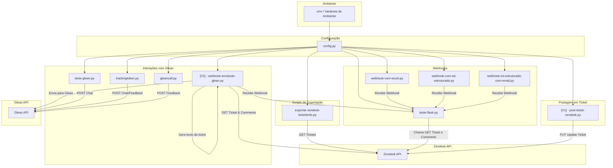

# Documentação Visual do Projeto

Este documento apresenta uma visão geral dos principais componentes e fluxos de dados do projeto "Zendesk - Glean - Answers".

Legenda:
- **.env / Variáveis de Ambiente**: arquivo que define credenciais e endpoints.
- **config.py**: módulo que centraliza o carregamento de configurações.
- **exportar-zendesk-ticketsinfo.py**: script de exemplo para exportar comentários de ticket para Excel.
- **Webhooks**: scripts Flask que recebem eventos do Zendesk e salvam dados em Excel/TXT.
- **Interações com Glean**: exemplos de envio de mensagens, obtenção de tokens e feedback.
- **Postagem em Ticket**: script para atualizar tickets via API do Zendesk.
- **Zendesk API** e **Glean API**: serviços externos consumidos pelos scripts.